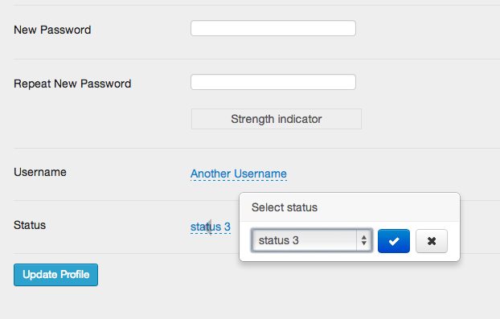

#[X-editable for WordPress](https://github.com/brasofilo/x-editable-for-wordpress)

Testing how to use X-editable inside WordPress admin area.

 - The `pk` value seem not to matter much, but it is essential to have it, simply put `1` for all fields

 - Bootstrap v3 is not working, using v2 in this demo.

 - Bootstrap CSS is messing with the Dashboard, needs cleanup.

